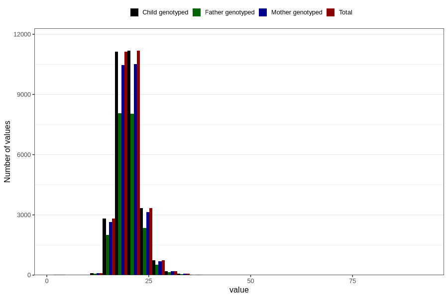

# weight_5y
Variable mapping to `LL13` in `Skjema5aar_v12`.
- Number of values:

| Value | Total | Child genotyped | Mother genotyped | Father genotyped |
| ----- | ----- | --------------- | ---------------- | ---------------- |
| Missing | 51196 | 51196 | 48196 | 31946 |
| Non-missing | 29610 | 29610 | 27828 | 21217 |
| 25th percentile | 18 | 18 | 18 | 18 |
| 50th percentile | 20 | 20 | 20 | 20 |
| 75th percentile | 21.5 | 21.5 | 21.5 | 21.5 |
| Mean | 20.019050996285 | 20.019050996285 | 20.023382923674 | 20.0005891502097 |
| Standard deviation | 3.07785751908664 | 3.07785751908664 | 3.09004510051856 | 3.04663710888705 |
| N | 29610 | 29610 | 27828 | 21217 |

