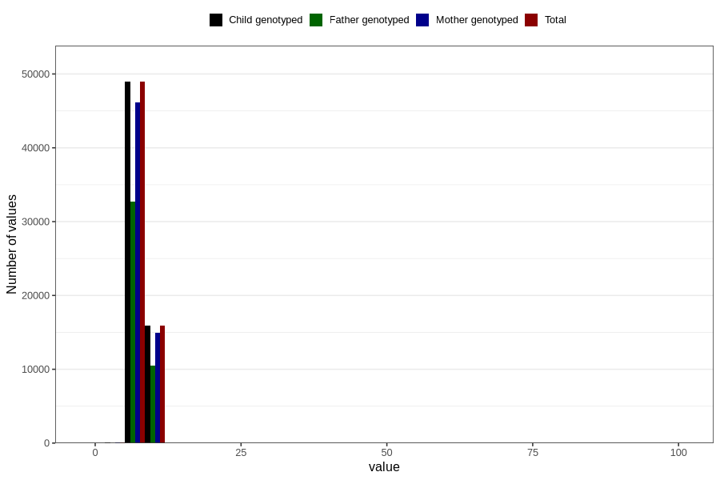

# weight_6m
Variable mapping to `DD224` in `Skjema4_6mnd_v12`.
- Number of values:

| Value | Total | Child genotyped | Mother genotyped | Father genotyped |
| ----- | ----- | --------------- | ---------------- | ---------------- |
| Missing | 15865 | 15865 | 14803 | 9818 |
| Non-missing | 64941 | 64941 | 61221 | 43345 |
| 25th percentile | 7.27 | 7.27 | 7.27 | 7.26 |
| 50th percentile | 7.885 | 7.885 | 7.88 | 7.88 |
| 75th percentile | 8.53 | 8.53 | 8.53 | 8.525 |
| Mean | 7.9377219322154 | 7.9377219322154 | 7.93714971986737 | 7.93375388164725 |
| Standard deviation | 1.17352469616702 | 1.17352469616702 | 1.1846730847236 | 1.14733013335413 |
| N | 64941 | 64941 | 61221 | 43345 |

