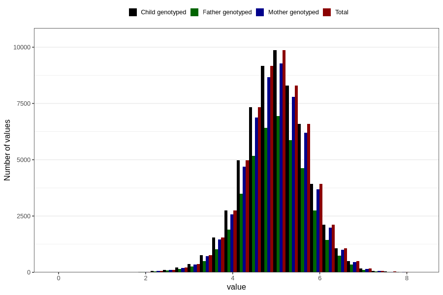

# weight_6w
Variable mapping to `DD212` in `Skjema4_6mnd_v12`.
- Number of values:

| Value | Total | Child genotyped | Mother genotyped | Father genotyped |
| ----- | ----- | --------------- | ---------------- | ---------------- |
| Missing | 20823 | 20823 | 19634 | 11197 |
| Non-missing | 59983 | 59983 | 56390 | 41966 |
| 25th percentile | 4.545 | 4.545 | 4.545 | 4.55 |
| 50th percentile | 5.01 | 5.01 | 5.005 | 5.01 |
| 75th percentile | 5.475 | 5.475 | 5.47 | 5.47 |
| Mean | 4.99948280346098 | 4.99948280346098 | 4.99851931193474 | 5.00083315064576 |
| Standard deviation | 0.729029652485954 | 0.729029652485954 | 0.728237785788509 | 0.723529619866251 |
| N | 59983 | 59983 | 56390 | 41966 |

