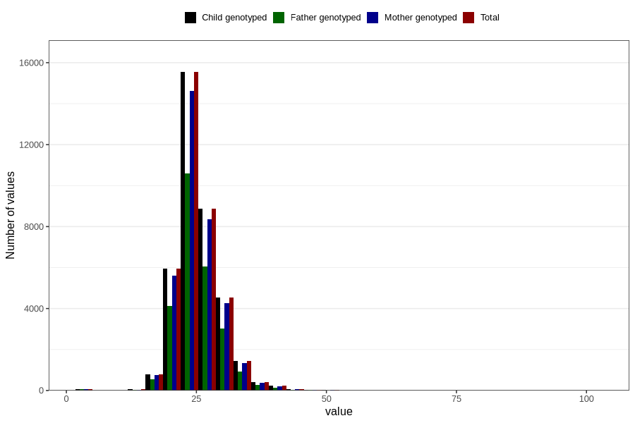

# weight_7y
Variable mapping to `JJ325` in `Skjema7aar_v12`.
- Number of values:

| Value | Total | Child genotyped | Mother genotyped | Father genotyped |
| ----- | ----- | --------------- | ---------------- | ---------------- |
| Missing | 42792 | 42792 | 40224 | 27364 |
| Non-missing | 38014 | 38014 | 35800 | 25799 |
| 25th percentile | 22.4 | 22.4 | 22.4 | 22.3 |
| 50th percentile | 25 | 25 | 25 | 24.9 |
| 75th percentile | 27.5 | 27.5 | 27.5 | 27.3 |
| Mean | 25.1982506444994 | 25.1982506444994 | 25.196251396648 | 25.1337803790845 |
| Standard deviation | 4.30708031354097 | 4.30708031354097 | 4.29308840253682 | 4.22508957367292 |
| N | 38014 | 38014 | 35800 | 25799 |

