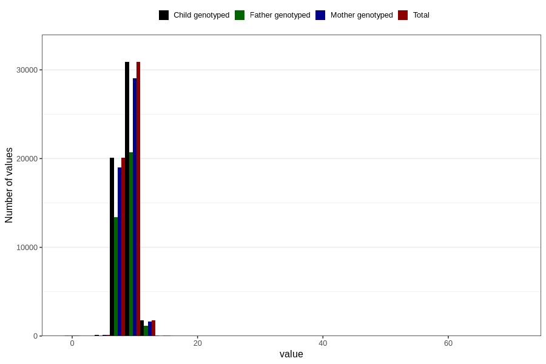

# weight_8m
Variable mapping to `EE386` in `Skjema5_18mnd_v12`.
- Number of values:

| Value | Total | Child genotyped | Mother genotyped | Father genotyped |
| ----- | ----- | --------------- | ---------------- | ---------------- |
| Missing | 27869 | 27869 | 26106 | 17716 |
| Non-missing | 52937 | 52937 | 49918 | 35447 |
| 25th percentile | 8.075 | 8.075 | 8.07425 | 8.08 |
| 50th percentile | 8.75 | 8.75 | 8.74 | 8.75 |
| 75th percentile | 9.46 | 9.46 | 9.46 | 9.46 |
| Mean | 8.79128337457733 | 8.79128337457733 | 8.79065253014945 | 8.79466129714785 |
| Standard deviation | 1.13314864023494 | 1.13314864023494 | 1.13448505794401 | 1.14465019000686 |
| N | 52937 | 52937 | 49918 | 35447 |

