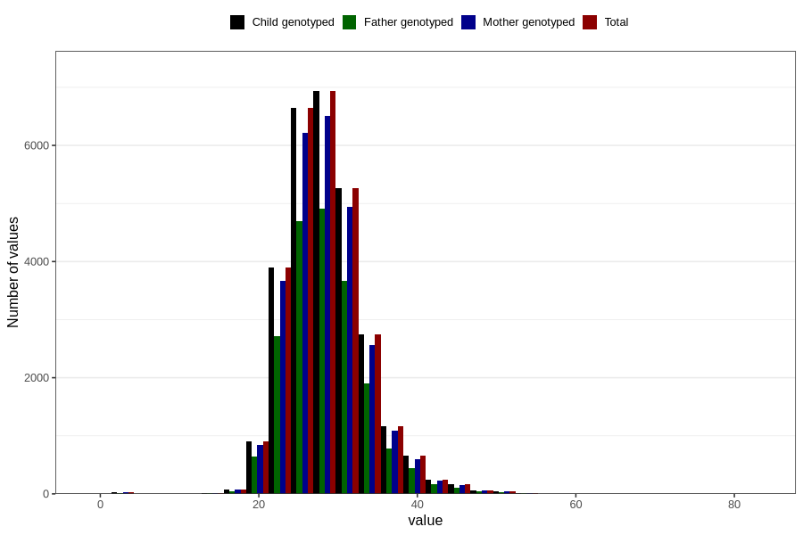

# weight_8y
Variable mapping to `NN25` in `Skjema8aar_v12`.
- Number of values:

| Value | Total | Child genotyped | Mother genotyped | Father genotyped |
| ----- | ----- | --------------- | ---------------- | ---------------- |
| Missing | 51974 | 51974 | 48960 | 32954 |
| Non-missing | 28832 | 28832 | 27064 | 20209 |
| 25th percentile | 25 | 25 | 25 | 25 |
| 50th percentile | 28 | 28 | 28 | 28 |
| 75th percentile | 31 | 31 | 31 | 31 |
| Mean | 28.4909059378468 | 28.4909059378468 | 28.4927689920189 | 28.4561828888119 |
| Standard deviation | 4.974222740403 | 4.974222740403 | 4.98305948462209 | 4.94471799423987 |
| N | 28832 | 28832 | 27064 | 20209 |

