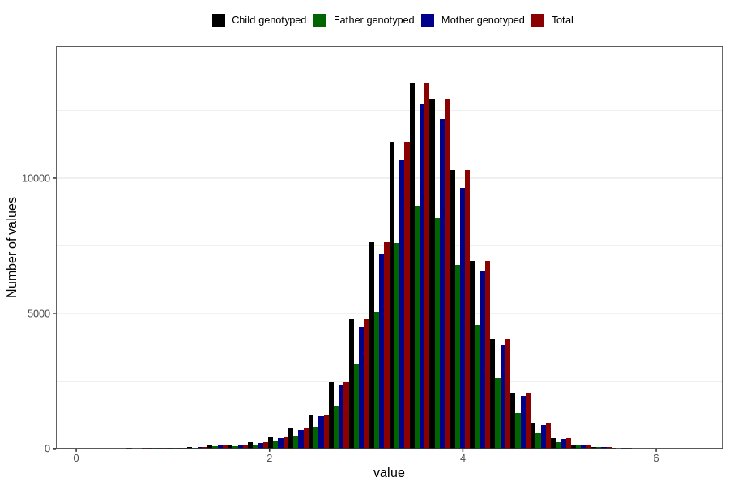

# weight_birth
Variable mapping to `VEKT` in `MFR_541_v12`.
Variable mapping to `VEKT` in `MFR_541_v12`.
- Number of values:

| Value | Total | Child genotyped | Mother genotyped | Father genotyped |
| ----- | ----- | --------------- | ---------------- | ---------------- |
| Missing | 99 | 99 | 94 | 64 |
| Non-missing | 80707 | 80707 | 75930 | 53099 |
| 25th percentile | 3.28 | 3.28 | 3.28 | 3.28 |
| 50th percentile | 3.62 | 3.62 | 3.62 | 3.615 |
| 75th percentile | 3.956 | 3.956 | 3.954 | 3.95 |
| Mean | 3.60643840063439 | 3.60643840063439 | 3.6062027393652 | 3.60500691161792 |
| Standard deviation | 0.546574598766546 | 0.546574598766546 | 0.546462075896278 | 0.542961594870001 |
| N | 80707 | 80707 | 75930 | 53099 |

