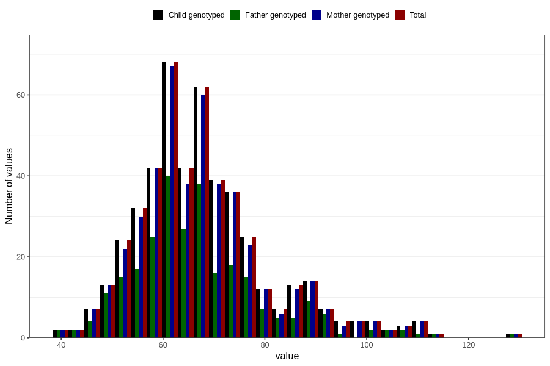

# weight_wf
Variable mapping to `WK15` in `WF_Klinikkskjema_v12`.
- Number of values:

| Value | Total | Child genotyped | Mother genotyped | Father genotyped |
| ----- | ----- | --------------- | ---------------- | ---------------- |
| Missing | 80336 | 80336 | 75571 | 52891 |
| Non-missing | 470 | 470 | 453 | 272 |
| 25th percentile | 59 | 59 | 59 | 59 |
| 50th percentile | 66 | 66 | 66 | 64.5 |
| 75th percentile | 74 | 74 | 74 | 73 |
| Mean | 67.863829787234 | 67.863829787234 | 67.8653421633554 | 67.1470588235294 |
| Standard deviation | 13.3046383295341 | 13.3046383295341 | 13.3480290772724 | 13.5085209745196 |
| N | 470 | 470 | 453 | 272 |

