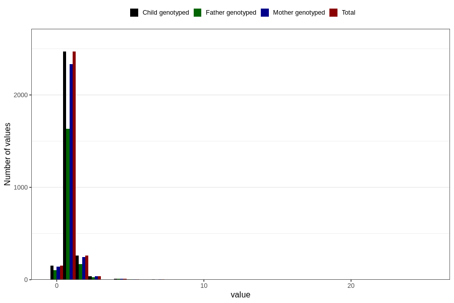

# accident_injury_number_12_18m
Variable mapping to `EE268` in `Skjema5_18mnd_v12`.
- Number of values:

| Value | Total | Child genotyped | Mother genotyped | Father genotyped |
| ----- | ----- | --------------- | ---------------- | ---------------- |
| Missing | 77858 | 77858 | 73236 | 51214 |
| Non-missing | 2948 | 2948 | 2788 | 1949 |
| 0 | 152 | 152 | 141 | 103 |
| 1 | 2469 | 2469 | 2336 | 1633 |
| 2 | 259 | 259 | 243 | 167 |
| 3 | 39 | 39 | 39 | 26 |
| 4 | 10 | 10 | 10 | 8 |
| 5 | 6 | 6 | 6 | 4 |
| 6 | 2 | 2 | 2 | 0 |
| 7 | 3 | 3 | 3 | 2 |
| 8 | 1 | 1 | 1 | 0 |
| 14 | 1 | 1 | 1 | 1 |
| 15 | 1 | 1 | 1 | 1 |
| 16 | 2 | 2 | 2 | 1 |
| 17 | 1 | 1 | 1 | 1 |
| 20 | 1 | 1 | 1 | 1 |
| 25 | 1 | 1 | 1 | 1 |

