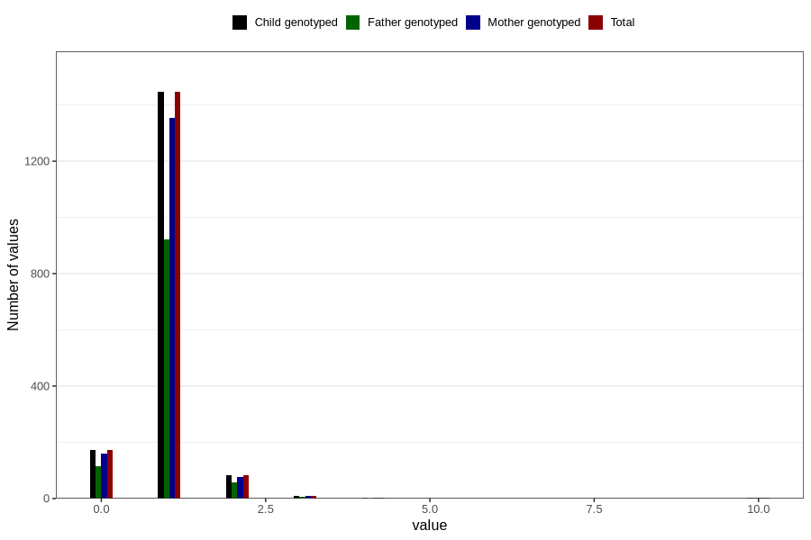

# accident_injury_number_6_11m
Variable mapping to `EE266` in `Skjema5_18mnd_v12`.
- Number of values:

| Value | Total | Child genotyped | Mother genotyped | Father genotyped |
| ----- | ----- | --------------- | ---------------- | ---------------- |
| Missing | 79089 | 79089 | 74417 | 52059 |
| Non-missing | 1717 | 1717 | 1607 | 1104 |
| 0 | 171 | 171 | 159 | 116 |
| 1 | 1446 | 1446 | 1354 | 922 |
| 2 | 84 | 84 | 78 | 56 |
| 3 | 9 | 9 | 9 | 7 |
| 4 | 2 | 2 | 2 | 0 |
| 6 | 1 | 1 | 1 | 0 |
| 7 | 1 | 1 | 1 | 0 |
| 9 | 1 | 1 | 1 | 1 |
| 10 | 2 | 2 | 2 | 2 |

