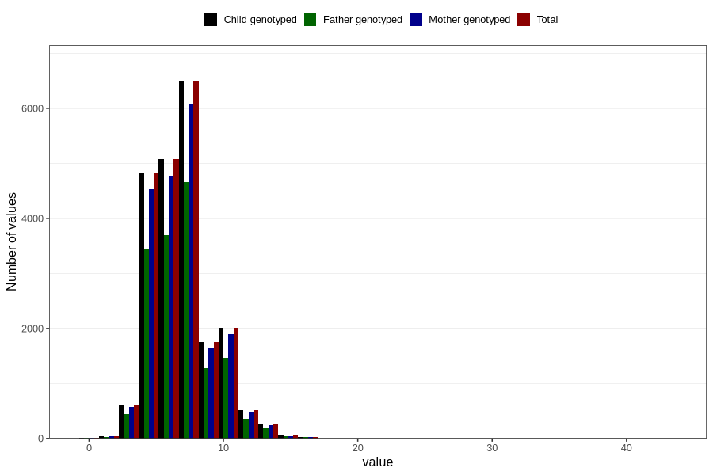

# age_first_tooth
Variable mapping to `EE1012` in `Skjema5_18mnd_v12`.
- Number of values:

| Value | Total | Child genotyped | Mother genotyped | Father genotyped |
| ----- | ----- | --------------- | ---------------- | ---------------- |
| Missing | 59105 | 59105 | 55643 | 37517 |
| Non-missing | 21701 | 21701 | 20381 | 15646 |
| 25th percentile | 5 | 5 | 5 | 5 |
| 50th percentile | 7 | 7 | 7 | 7 |
| 75th percentile | 8 | 8 | 8 | 8 |
| Mean | 6.95373485092853 | 6.95373485092853 | 6.94637162062705 | 6.95481273168861 |
| Standard deviation | 2.2587826519342 | 2.2587826519342 | 2.24047853631872 | 2.24553891902062 |
| N | 21701 | 21701 | 20381 | 15646 |

