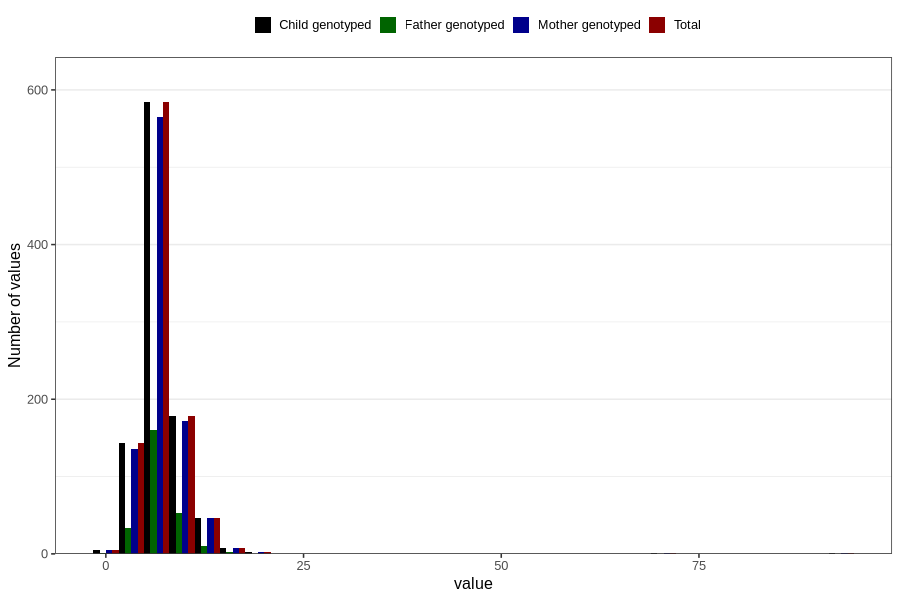

# age_lost_first_tooth_months
Variable mapping to `JJ330` in `Skjema7aar_v12`.
- Number of values:

| Value | Total | Child genotyped | Mother genotyped | Father genotyped |
| ----- | ----- | --------------- | ---------------- | ---------------- |
| Missing | 79838 | 79838 | 75088 | 52904 |
| Non-missing | 968 | 968 | 936 | 259 |
| 25th percentile | 5 | 5 | 5 | 5.5 |
| 50th percentile | 6 | 6 | 6 | 7 |
| 75th percentile | 8 | 8 | 8 | 8.5 |
| Mean | 7.14256198347107 | 7.14256198347107 | 7.16880341880342 | 7.08880308880309 |
| Standard deviation | 4.29091130177147 | 4.29091130177147 | 4.34862189244518 | 2.42480521790857 |
| N | 968 | 968 | 936 | 259 |

