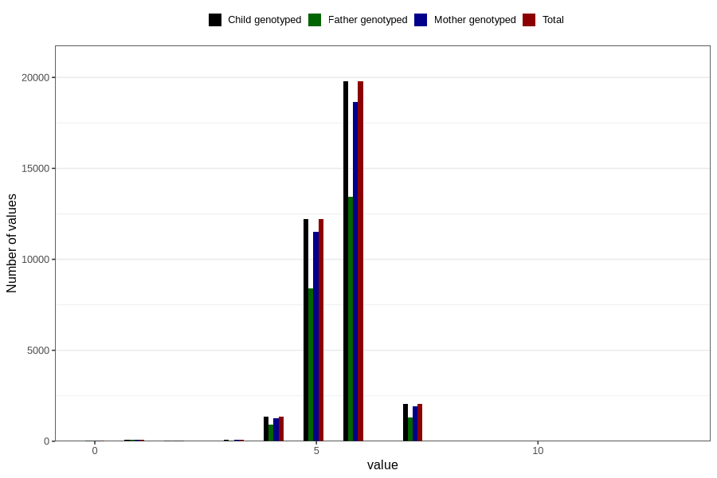

# age_lost_first_tooth_years
Variable mapping to `JJ332` in `Skjema7aar_v12`.
- Number of values:

| Value | Total | Child genotyped | Mother genotyped | Father genotyped |
| ----- | ----- | --------------- | ---------------- | ---------------- |
| Missing | 45153 | 45153 | 42424 | 28938 |
| Non-missing | 35653 | 35653 | 33600 | 24225 |
| 0 | 52 | 52 | 50 | 34 |
| 1 | 96 | 96 | 90 | 61 |
| 2 | 29 | 29 | 27 | 21 |
| 3 | 89 | 89 | 80 | 55 |
| 4 | 1360 | 1360 | 1265 | 915 |
| 5 | 12216 | 12216 | 11502 | 8397 |
| 6 | 19777 | 19777 | 18666 | 13421 |
| 7 | 2032 | 2032 | 1918 | 1321 |
| 8 | 1 | 1 | 1 | 0 |
| 13 | 1 | 1 | 1 | 0 |

