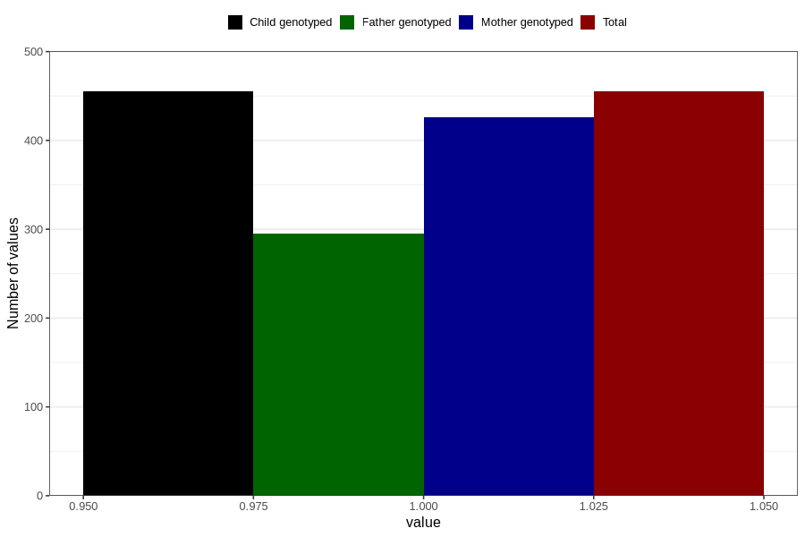

# allergy_affecing_eyes_nose_previous_3y
Variable mapping to `GG75` in `Skjema6_3aar_v12`.
- Number of values:

| Value | Total | Child genotyped | Mother genotyped | Father genotyped |
| ----- | ----- | --------------- | ---------------- | ---------------- |
| Missing | 80351 | 80351 | 75598 | 52868 |
| Non-missing | 455 | 455 | 426 | 295 |
| 1 | 455 | 455 | 426 | 295 |

