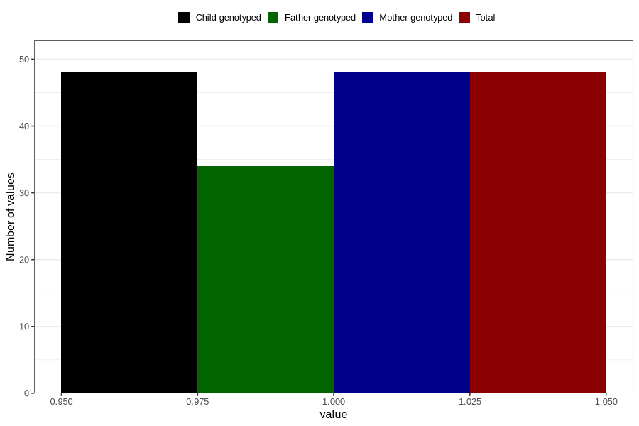

# aspergers_syndrome_7y
Variable mapping to `JJ437` in `Skjema7aar_v12`.
- Number of values:

| Value | Total | Child genotyped | Mother genotyped | Father genotyped |
| ----- | ----- | --------------- | ---------------- | ---------------- |
| Missing | 80758 | 80758 | 75976 | 53129 |
| Non-missing | 48 | 48 | 48 | 34 |
| 1 | 48 | 48 | 48 | 34 |

