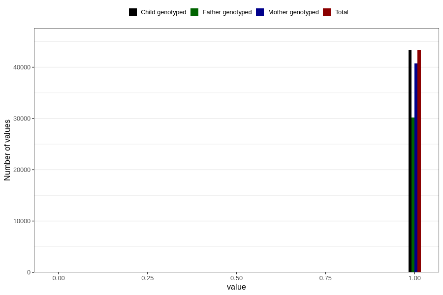

# autistic_traits_2_no_3y
Variable mapping to `GG582` in `Skjema6_3aar_v12`.
- Number of values:

| Value | Total | Child genotyped | Mother genotyped | Father genotyped |
| ----- | ----- | --------------- | ---------------- | ---------------- |
| Missing | 37490 | 37490 | 35291 | 22961 |
| Non-missing | 43316 | 43316 | 40733 | 30202 |
| 0 | 21 | 21 | 19 | 12 |
| 1 | 43295 | 43295 | 40714 | 30190 |

