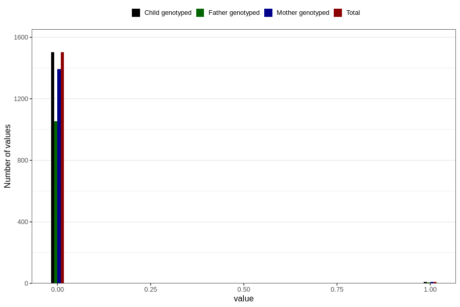

# autistic_traits_2_previous_3y
Variable mapping to `GG584` in `Skjema6_3aar_v12`.
- Number of values:

| Value | Total | Child genotyped | Mother genotyped | Father genotyped |
| ----- | ----- | --------------- | ---------------- | ---------------- |
| Missing | 79294 | 79294 | 74624 | 52103 |
| Non-missing | 1512 | 1512 | 1400 | 1060 |
| 0 | 1502 | 1502 | 1392 | 1054 |
| 1 | 10 | 10 | 8 | 6 |

