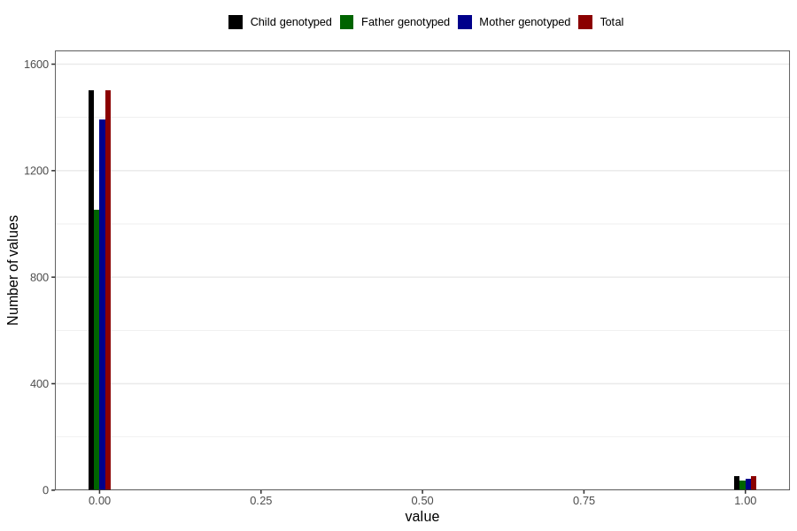

# autistic_traits_2_yes_3y
Variable mapping to `GG583` in `Skjema6_3aar_v12`.
- Number of values:

| Value | Total | Child genotyped | Mother genotyped | Father genotyped |
| ----- | ----- | --------------- | ---------------- | ---------------- |
| Missing | 79252 | 79252 | 74590 | 52075 |
| Non-missing | 1554 | 1554 | 1434 | 1088 |
| 0 | 1501 | 1501 | 1392 | 1053 |
| 1 | 53 | 53 | 42 | 35 |

