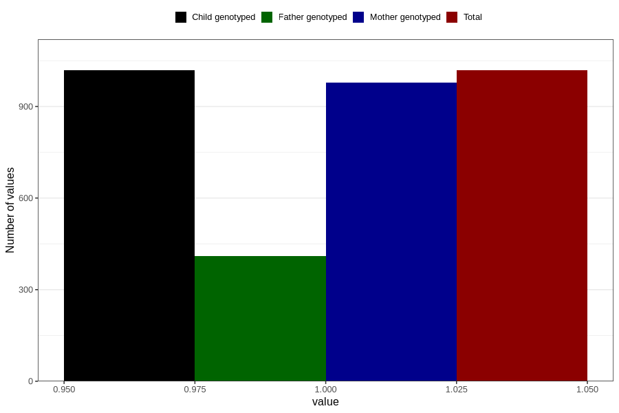

# autistic_traits_no_3y
Variable mapping to `GG101` in `Skjema6_3aar_v12`.
- Number of values:

| Value | Total | Child genotyped | Mother genotyped | Father genotyped |
| ----- | ----- | --------------- | ---------------- | ---------------- |
| Missing | 79788 | 79788 | 75046 | 52753 |
| Non-missing | 1018 | 1018 | 978 | 410 |
| 1 | 1018 | 1018 | 978 | 410 |

