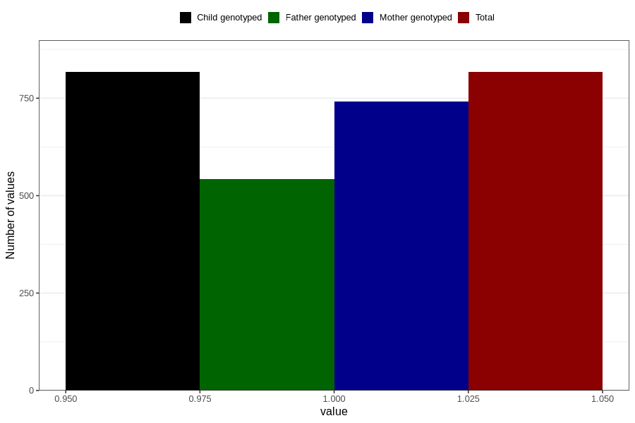

# behavioral_problems_difficult_and_unruly_past_8y
Variable mapping to `NN58` in `Skjema8aar_v12`.
- Number of values:

| Value | Total | Child genotyped | Mother genotyped | Father genotyped |
| ----- | ----- | --------------- | ---------------- | ---------------- |
| Missing | 79989 | 79989 | 75282 | 52620 |
| Non-missing | 817 | 817 | 742 | 543 |
| 1 | 817 | 817 | 742 | 543 |

