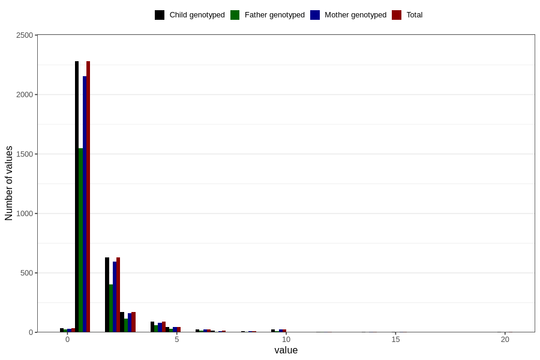

# bronchitis_freq_3y
Variable mapping to `GG144` in `Skjema6_3aar_v12`.
- Number of values:

| Value | Total | Child genotyped | Mother genotyped | Father genotyped |
| ----- | ----- | --------------- | ---------------- | ---------------- |
| Missing | 77476 | 77476 | 72879 | 50935 |
| Non-missing | 3330 | 3330 | 3145 | 2228 |
| 0 | 33 | 33 | 32 | 23 |
| 1 | 2279 | 2279 | 2156 | 1551 |
| 2 | 631 | 631 | 596 | 405 |
| 3 | 171 | 171 | 162 | 115 |
| 4 | 92 | 92 | 80 | 61 |
| 5 | 45 | 45 | 43 | 32 |
| 6 | 24 | 24 | 24 | 17 |
| 7 | 12 | 12 | 11 | 6 |
| 8 | 8 | 8 | 8 | 4 |
| 9 | 1 | 1 | 1 | 0 |
| 10 | 24 | 24 | 24 | 9 |
| 12 | 2 | 2 | 2 | 2 |
| 14 | 2 | 2 | 2 | 1 |
| 15 | 2 | 2 | 2 | 1 |
| 16 | 1 | 1 | 0 | 0 |
| 18 | 1 | 1 | 1 | 1 |
| 20 | 2 | 2 | 1 | 0 |

