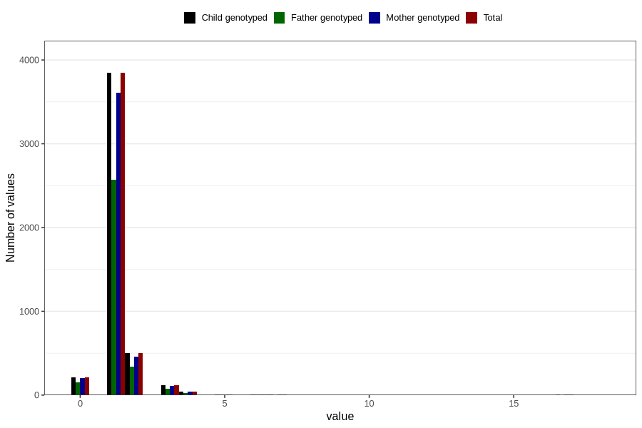

# bronchitis_rs_pneumonia_number_12_18m
Variable mapping to `EE238` in `Skjema5_18mnd_v12`.
- Number of values:

| Value | Total | Child genotyped | Mother genotyped | Father genotyped |
| ----- | ----- | --------------- | ---------------- | ---------------- |
| Missing | 76051 | 76051 | 71570 | 49983 |
| Non-missing | 4755 | 4755 | 4454 | 3180 |
| 0 | 213 | 213 | 200 | 151 |
| 1 | 3845 | 3845 | 3613 | 2571 |
| 2 | 504 | 504 | 458 | 337 |
| 3 | 116 | 116 | 113 | 76 |
| 4 | 41 | 41 | 38 | 28 |
| 5 | 10 | 10 | 10 | 4 |
| 6 | 7 | 7 | 6 | 4 |
| 7 | 5 | 5 | 4 | 3 |
| 9 | 1 | 1 | 1 | 1 |
| 10 | 3 | 3 | 3 | 2 |
| 14 | 2 | 2 | 2 | 1 |
| 16 | 1 | 1 | 1 | 0 |
| 17 | 5 | 5 | 4 | 1 |
| 18 | 2 | 2 | 1 | 1 |

