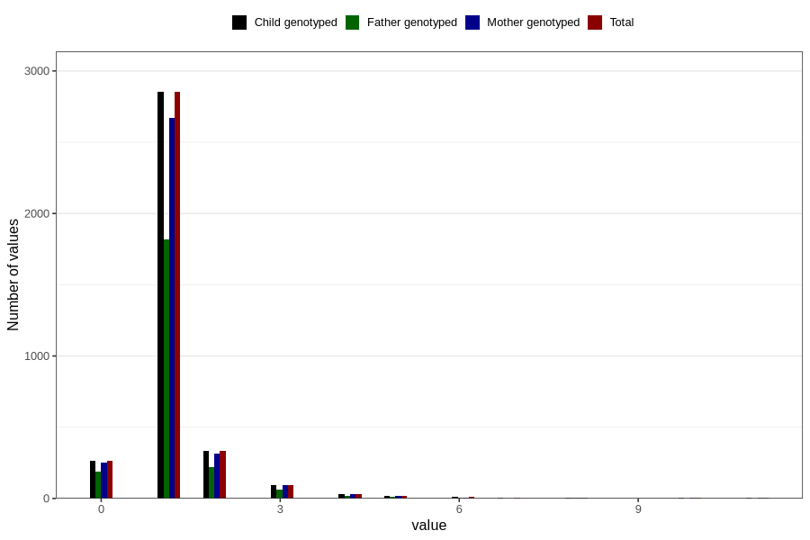

# bronchitis_rs_pneumonia_number_6_11m
Variable mapping to `EE236` in `Skjema5_18mnd_v12`.
- Number of values:

| Value | Total | Child genotyped | Mother genotyped | Father genotyped |
| ----- | ----- | --------------- | ---------------- | ---------------- |
| Missing | 77184 | 77184 | 72629 | 50835 |
| Non-missing | 3622 | 3622 | 3395 | 2328 |
| 0 | 267 | 267 | 250 | 191 |
| 1 | 2852 | 2852 | 2672 | 1820 |
| 2 | 334 | 334 | 312 | 218 |
| 3 | 97 | 97 | 92 | 62 |
| 4 | 31 | 31 | 30 | 16 |
| 5 | 18 | 18 | 18 | 12 |
| 6 | 9 | 9 | 8 | 3 |
| 7 | 3 | 3 | 2 | 0 |
| 8 | 5 | 5 | 5 | 3 |
| 10 | 3 | 3 | 3 | 1 |
| 11 | 3 | 3 | 3 | 2 |

