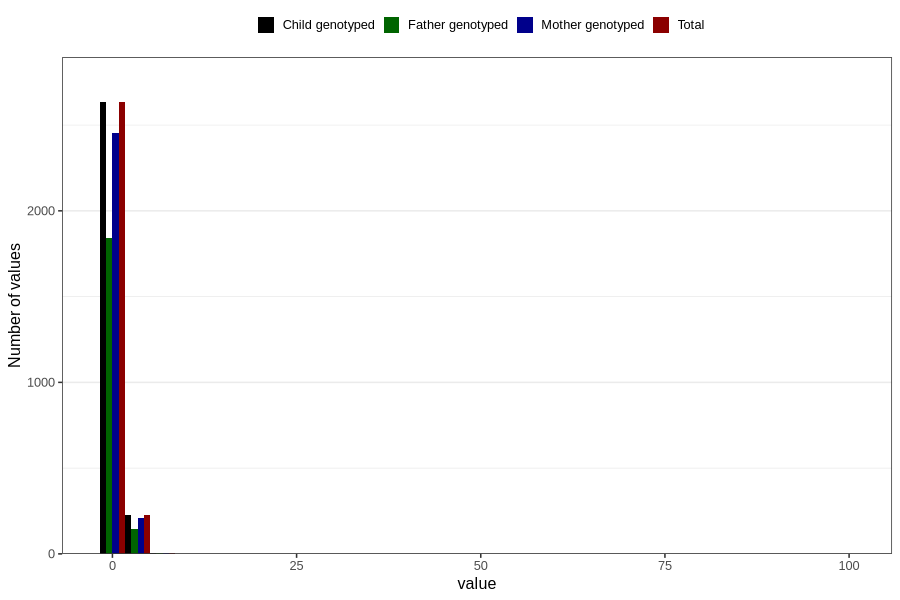

# bronchitis_rs_virus_pneumonia_freq_6m
Variable mapping to `DD280` in `Skjema4_6mnd_v12`.
- Number of values:

| Value | Total | Child genotyped | Mother genotyped | Father genotyped |
| ----- | ----- | --------------- | ---------------- | ---------------- |
| Missing | 77935 | 77935 | 73350 | 51169 |
| Non-missing | 2871 | 2871 | 2674 | 1994 |
| 0 | 86 | 86 | 81 | 62 |
| 1 | 2547 | 2547 | 2372 | 1780 |
| 2 | 171 | 171 | 159 | 111 |
| 3 | 42 | 42 | 38 | 28 |
| 4 | 8 | 8 | 8 | 4 |
| 5 | 4 | 4 | 3 | 2 |
| 6 | 3 | 3 | 3 | 1 |
| 7 | 3 | 3 | 3 | 3 |
| 8 | 1 | 1 | 1 | 0 |
| 9 | 1 | 1 | 1 | 1 |
| 10 | 1 | 1 | 1 | 0 |
| 12 | 1 | 1 | 1 | 0 |
| 14 | 1 | 1 | 1 | 0 |
| 16 | 1 | 1 | 1 | 1 |
| 99 | 1 | 1 | 1 | 1 |

