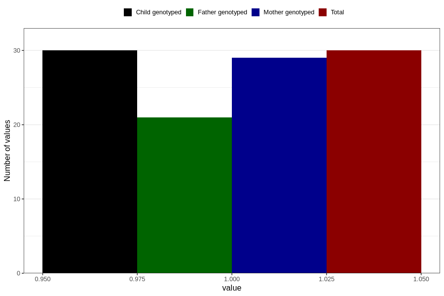

# cancer_7y
Variable mapping to `JJ428` in `Skjema7aar_v12`.
- Number of values:

| Value | Total | Child genotyped | Mother genotyped | Father genotyped |
| ----- | ----- | --------------- | ---------------- | ---------------- |
| Missing | 80776 | 80776 | 75995 | 53142 |
| Non-missing | 30 | 30 | 29 | 21 |
| 1 | 30 | 30 | 29 | 21 |

