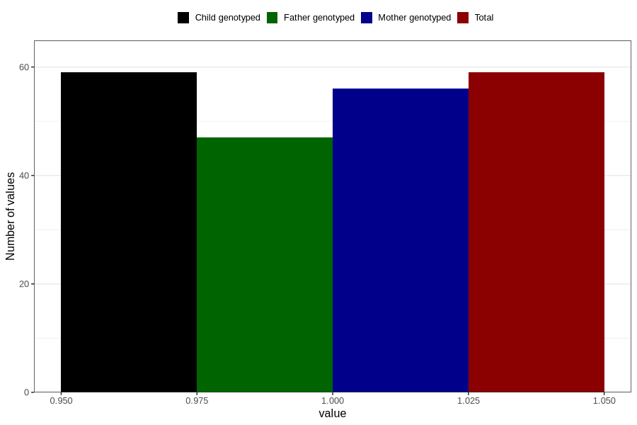

# cerebral_palsy_7y
Variable mapping to `JJ430` in `Skjema7aar_v12`.
- Number of values:

| Value | Total | Child genotyped | Mother genotyped | Father genotyped |
| ----- | ----- | --------------- | ---------------- | ---------------- |
| Missing | 80747 | 80747 | 75968 | 53116 |
| Non-missing | 59 | 59 | 56 | 47 |
| 1 | 59 | 59 | 56 | 47 |

