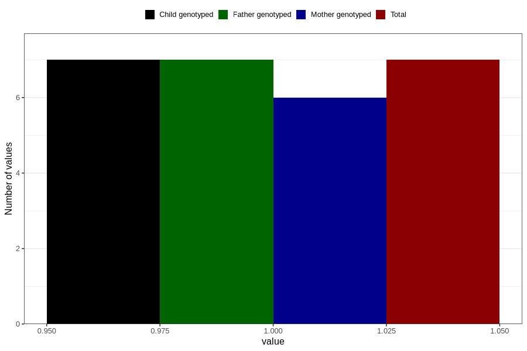

# cerebral_palsy_previous_3y
Variable mapping to `GG43` in `Skjema6_3aar_v12`.
- Number of values:

| Value | Total | Child genotyped | Mother genotyped | Father genotyped |
| ----- | ----- | --------------- | ---------------- | ---------------- |
| Missing | 80799 | 80799 | 76018 | 53156 |
| Non-missing | 7 | 7 | 6 | 7 |
| 1 | 7 | 7 | 6 | 7 |

