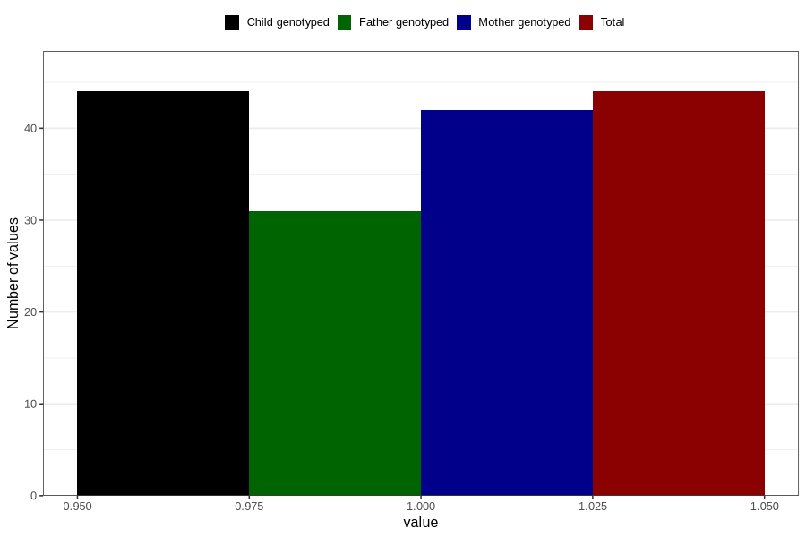

# chromosomal_defect_6m
Variable mapping to `DD1111` in `Skjema4_6mnd_v12`.
- Number of values:

| Value | Total | Child genotyped | Mother genotyped | Father genotyped |
| ----- | ----- | --------------- | ---------------- | ---------------- |
| Missing | 80762 | 80762 | 75982 | 53132 |
| Non-missing | 44 | 44 | 42 | 31 |
| 1 | 44 | 44 | 42 | 31 |

