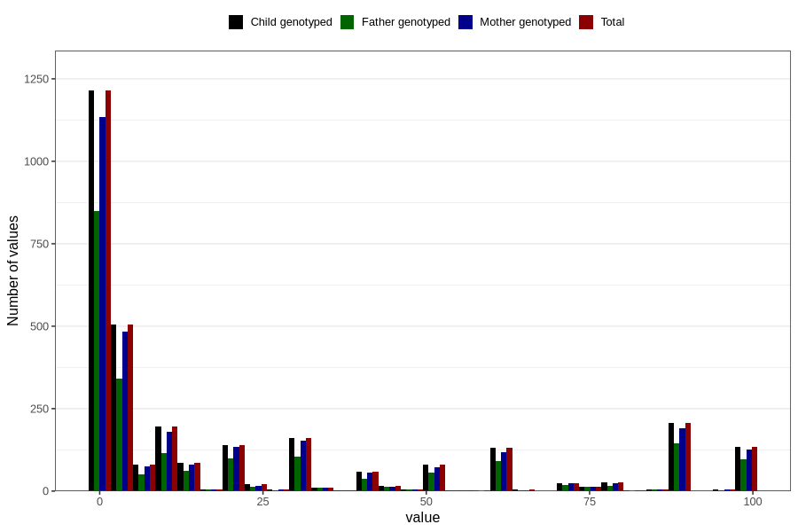

# colic_freq_6m
Variable mapping to `DD304` in `Skjema4_6mnd_v12`.
- Number of values:

| Value | Total | Child genotyped | Mother genotyped | Father genotyped |
| ----- | ----- | --------------- | ---------------- | ---------------- |
| Missing | 77666 | 77666 | 73087 | 51010 |
| Non-missing | 3140 | 3140 | 2937 | 2153 |
| 25th percentile | 1 | 1 | 1 | 1 |
| 50th percentile | 4 | 4 | 4 | 4 |
| 75th percentile | 30 | 30 | 30 | 30 |
| Mean | 21.875796178344 | 21.875796178344 | 21.6809669731018 | 22.1504876915931 |
| Standard deviation | 31.2004768370818 | 31.2004768370818 | 31.1357014150457 | 31.5589172999773 |
| N | 3140 | 3140 | 2937 | 2153 |

