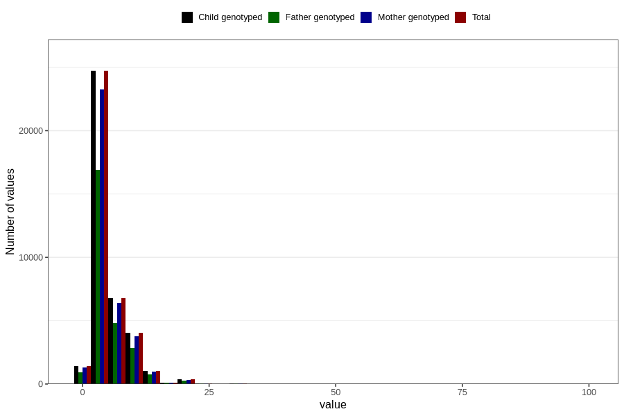

# common_cold_freq_3y
Variable mapping to `GG129` in `Skjema6_3aar_v12`.
- Number of values:

| Value | Total | Child genotyped | Mother genotyped | Father genotyped |
| ----- | ----- | --------------- | ---------------- | ---------------- |
| Missing | 42244 | 42244 | 39755 | 26553 |
| Non-missing | 38562 | 38562 | 36269 | 26610 |
| 25th percentile | 3 | 3 | 3 | 3 |
| 50th percentile | 4 | 4 | 4 | 4 |
| 75th percentile | 6 | 6 | 6 | 6 |
| Mean | 5.27462268554536 | 5.27462268554536 | 5.26863161377485 | 5.31619691845171 |
| Standard deviation | 4.18426785110094 | 4.18426785110094 | 4.16725869831074 | 4.11925063033336 |
| N | 38562 | 38562 | 36269 | 26610 |

