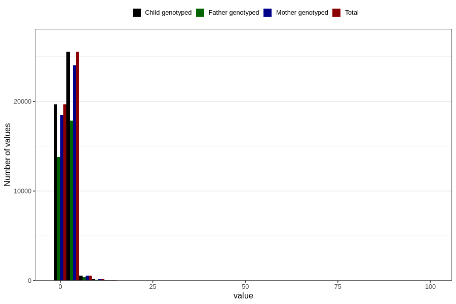

# common_cold_freq_6m
Variable mapping to `DD264` in `Skjema4_6mnd_v12`.
- Number of values:

| Value | Total | Child genotyped | Mother genotyped | Father genotyped |
| ----- | ----- | --------------- | ---------------- | ---------------- |
| Missing | 34765 | 34765 | 32758 | 20945 |
| Non-missing | 46041 | 46041 | 43266 | 32218 |
| 25th percentile | 1 | 1 | 1 | 1 |
| 50th percentile | 2 | 2 | 2 | 2 |
| 75th percentile | 2 | 2 | 2 | 2 |
| Mean | 1.97619513042723 | 1.97619513042723 | 1.97415984837979 | 1.97296542305543 |
| Standard deviation | 1.76416884109494 | 1.76416884109494 | 1.78065098144687 | 1.74147342911154 |
| N | 46041 | 46041 | 43266 | 32218 |

