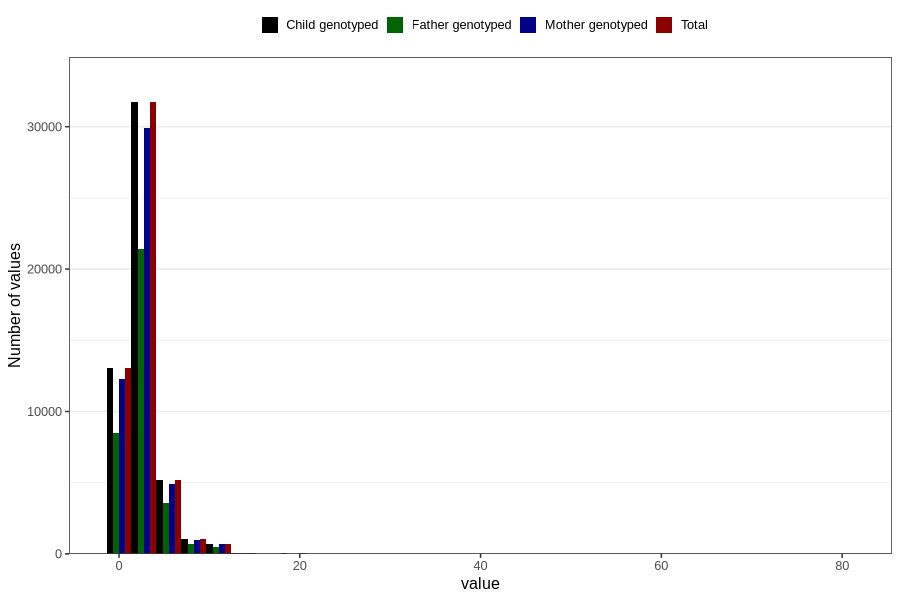

# common_cold_number_12_18m
Variable mapping to `EE218` in `Skjema5_18mnd_v12`.
- Number of values:

| Value | Total | Child genotyped | Mother genotyped | Father genotyped |
| ----- | ----- | --------------- | ---------------- | ---------------- |
| Missing | 29052 | 29052 | 27226 | 18479 |
| Non-missing | 51754 | 51754 | 48798 | 34684 |
| Filled in text or mark instead of number | 6 | 6 | 5 |5 |
| 25th percentile | 1 | 1 | 1 | 2 |
| 50th percentile | 2 | 2 | 2 | 2 |
| 75th percentile | 3 | 3 | 3 | 4 |
| Mean | 2.74779701630981 | 2.74779701630981 | 2.74596765929539 | 2.77908820900257 |
| Standard deviation | 1.91657160999353 | 1.91657160999353 | 1.9084873405031 | 1.9304221397141 |
| N | 51748 | 51748 | 48793 | 34679 |

