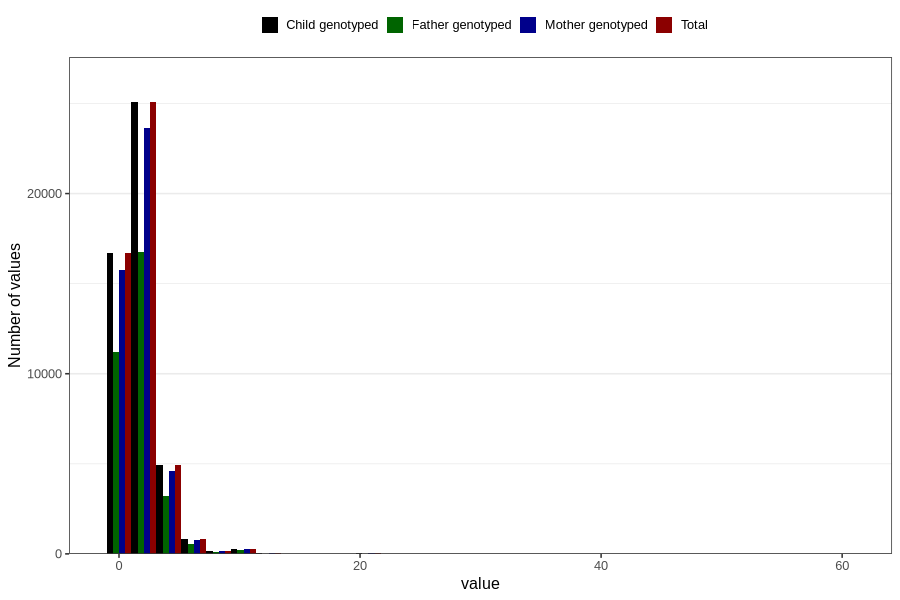

# common_cold_number_6_11m
Variable mapping to `EE216` in `Skjema5_18mnd_v12`.
- Number of values:

| Value | Total | Child genotyped | Mother genotyped | Father genotyped |
| ----- | ----- | --------------- | ---------------- | ---------------- |
| Missing | 32735 | 32735 | 30715 | 21030 |
| Non-missing | 48071 | 48071 | 45309 | 32133 |
| Filled in text or mark instead of number | 8 | 8 | 7 |6 |
| 25th percentile | 1 | 1 | 1 | 1 |
| 50th percentile | 2 | 2 | 2 | 2 |
| 75th percentile | 3 | 3 | 3 | 3 |
| Mean | 2.21781828017394 | 2.21781828017394 | 2.2152443600724 | 2.21449248295826 |
| Standard deviation | 1.5250850767689 | 1.5250850767689 | 1.52594792836619 | 1.54688631092139 |
| N | 48063 | 48063 | 45302 | 32127 |

