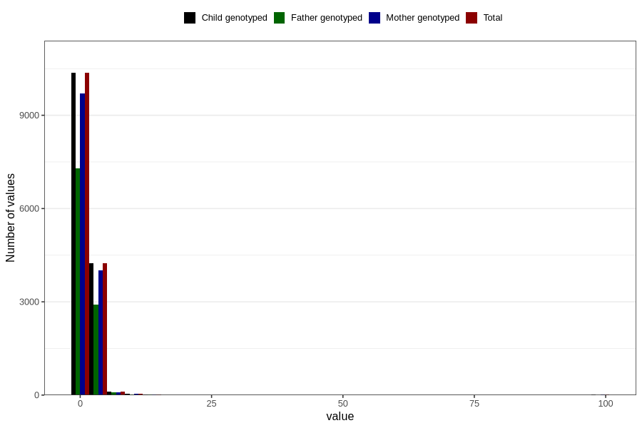

# conjunctivities_freq_6m
Variable mapping to `DD292` in `Skjema4_6mnd_v12`.
- Number of values:

| Value | Total | Child genotyped | Mother genotyped | Father genotyped |
| ----- | ----- | --------------- | ---------------- | ---------------- |
| Missing | 65987 | 65987 | 62109 | 42814 |
| Non-missing | 14819 | 14819 | 13915 | 10349 |
| 25th percentile | 1 | 1 | 1 | 1 |
| 50th percentile | 1 | 1 | 1 | 1 |
| 75th percentile | 2 | 2 | 2 | 2 |
| Mean | 1.6103650718672 | 1.6103650718672 | 1.61516349263385 | 1.587399748768 |
| Standard deviation | 3.00216154554291 | 3.00216154554291 | 3.06730828007655 | 2.90967284578613 |
| N | 14819 | 14819 | 13915 | 10349 |

