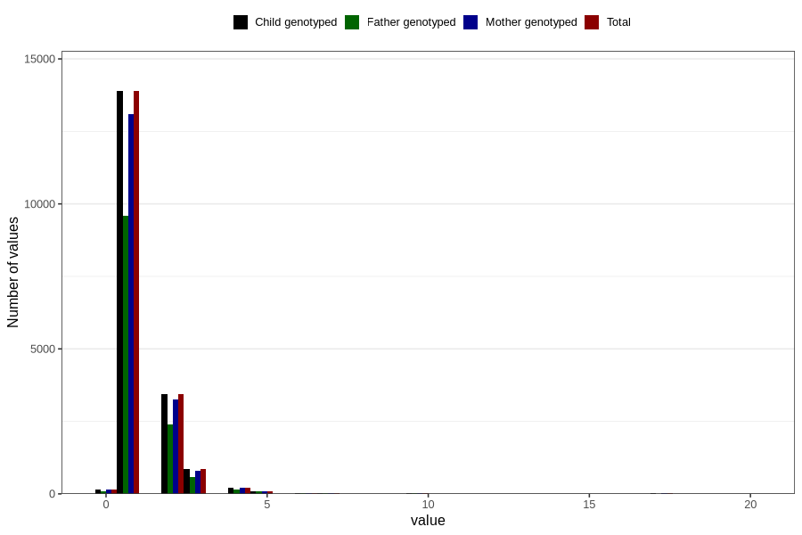

# conjunctivitis_number_12_18m
Variable mapping to `EE253` in `Skjema5_18mnd_v12`.
- Number of values:

| Value | Total | Child genotyped | Mother genotyped | Father genotyped |
| ----- | ----- | --------------- | ---------------- | ---------------- |
| Missing | 62038 | 62038 | 58321 | 40191 |
| Non-missing | 18768 | 18768 | 17703 | 12972 |
| Filled in text or mark instead of number | 1 | 1 | 1 |0 |
| 25th percentile | 1 | 1 | 1 | 1 |
| 50th percentile | 1 | 1 | 1 | 1 |
| 75th percentile | 2 | 2 | 2 | 2 |
| Mean | 1.38775510204082 | 1.38775510204082 | 1.38950401084623 | 1.39276904101141 |
| Standard deviation | 1.07526881907528 | 1.07526881907528 | 1.0808607572519 | 1.10674029628475 |
| N | 18767 | 18767 | 17702 | 12972 |

