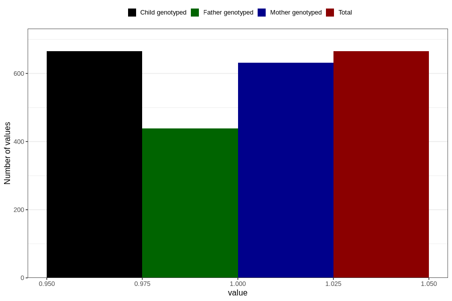

# delayed_motor_development_previous_3y
Variable mapping to `GG39` in `Skjema6_3aar_v12`.
- Number of values:

| Value | Total | Child genotyped | Mother genotyped | Father genotyped |
| ----- | ----- | --------------- | ---------------- | ---------------- |
| Missing | 80141 | 80141 | 75392 | 52724 |
| Non-missing | 665 | 665 | 632 | 439 |
| 1 | 665 | 665 | 632 | 439 |

