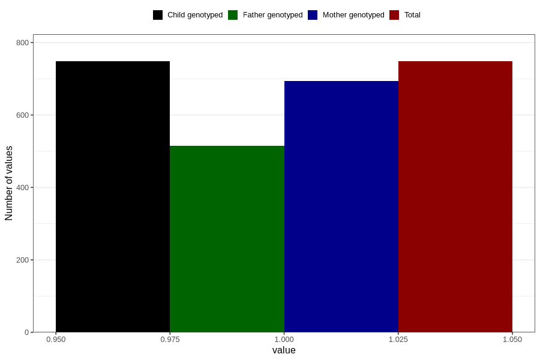

# delayed_motor_development_yes_18m
Variable mapping to `EE800` in `Skjema5_18mnd_v12`.
- Number of values:

| Value | Total | Child genotyped | Mother genotyped | Father genotyped |
| ----- | ----- | --------------- | ---------------- | ---------------- |
| Missing | 80058 | 80058 | 75331 | 52648 |
| Non-missing | 748 | 748 | 693 | 515 |
| 1 | 748 | 748 | 693 | 515 |

