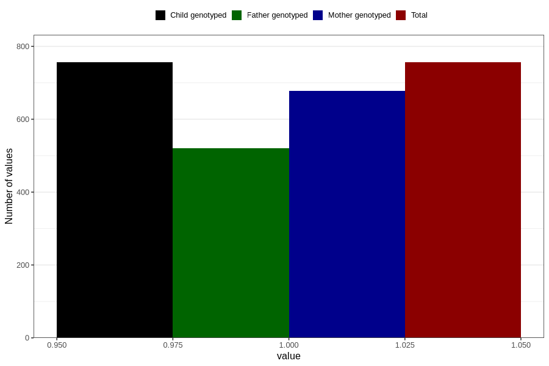

# delayed_or_abnormal_language_development_currently_8y
Variable mapping to `NN41` in `Skjema8aar_v12`.
- Number of values:

| Value | Total | Child genotyped | Mother genotyped | Father genotyped |
| ----- | ----- | --------------- | ---------------- | ---------------- |
| Missing | 80050 | 80050 | 75347 | 52643 |
| Non-missing | 756 | 756 | 677 | 520 |
| 1 | 756 | 756 | 677 | 520 |

