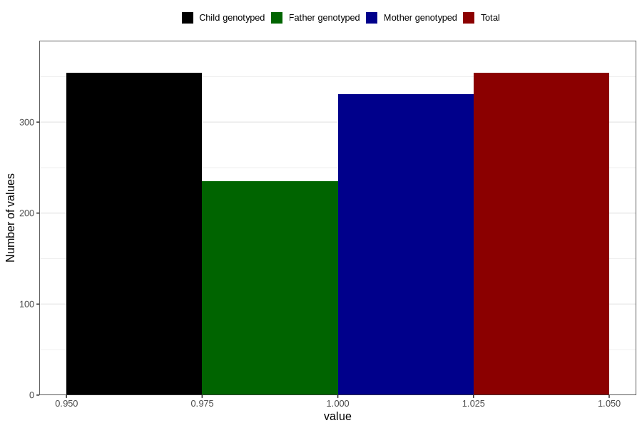

# delayed_psychomotor_development_past_8y
Variable mapping to `NN38` in `Skjema8aar_v12`.
- Number of values:

| Value | Total | Child genotyped | Mother genotyped | Father genotyped |
| ----- | ----- | --------------- | ---------------- | ---------------- |
| Missing | 80452 | 80452 | 75693 | 52928 |
| Non-missing | 354 | 354 | 331 | 235 |
| 1 | 354 | 354 | 331 | 235 |

