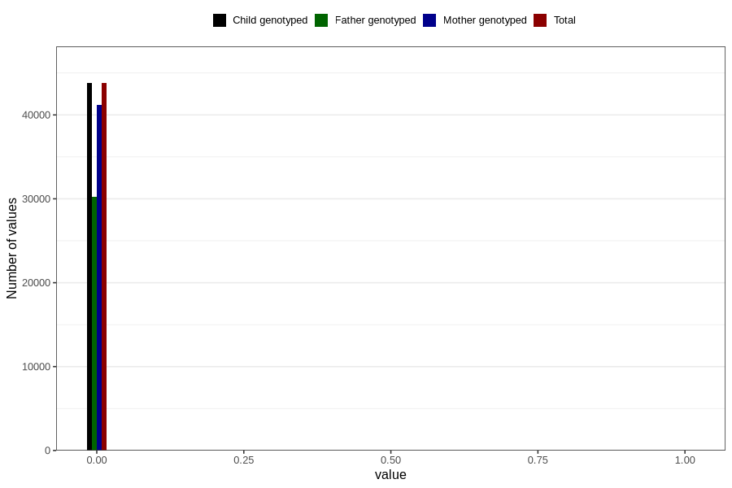

# diabetes_3y
Variable created during phenotype curation.
- Number of values:

| Value | Total | Child genotyped | Mother genotyped | Father genotyped |
| ----- | ----- | --------------- | ---------------- | ---------------- |
| Missing | 36997 | 36997 | 34802 | 22891 |
| Non-missing | 43809 | 43809 | 41222 | 30272 |
| 0 | 43783 | 43783 | 41197 | 30253 |
| 1 | 26 | 26 | 25 | 19 |

