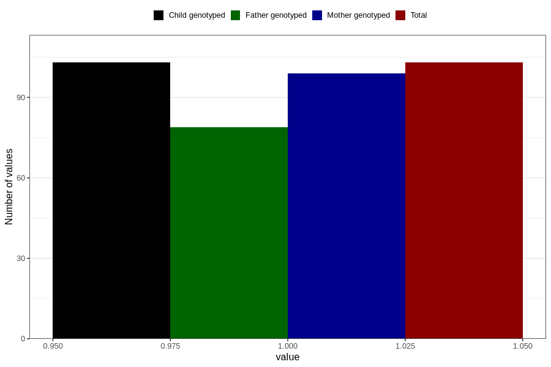

# diabetes_7y
Variable mapping to `JJ429` in `Skjema7aar_v12`.
- Number of values:

| Value | Total | Child genotyped | Mother genotyped | Father genotyped |
| ----- | ----- | --------------- | ---------------- | ---------------- |
| Missing | 80703 | 80703 | 75925 | 53084 |
| Non-missing | 103 | 103 | 99 | 79 |
| 1 | 103 | 103 | 99 | 79 |

