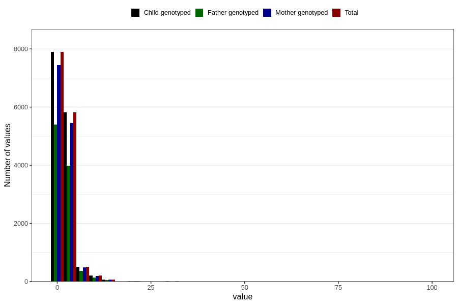

# ear_infection_freq_3y
Variable mapping to `GG138` in `Skjema6_3aar_v12`.
- Number of values:

| Value | Total | Child genotyped | Mother genotyped | Father genotyped |
| ----- | ----- | --------------- | ---------------- | ---------------- |
| Missing | 66280 | 66280 | 62344 | 43209 |
| Non-missing | 14526 | 14526 | 13680 | 9954 |
| 25th percentile | 1 | 1 | 1 | 1 |
| 50th percentile | 1 | 1 | 1 | 1 |
| 75th percentile | 2 | 2 | 2 | 2 |
| Mean | 2.1372022580201 | 2.1372022580201 | 2.13611111111111 | 2.12788828611613 |
| Standard deviation | 2.57210718010334 | 2.57210718010334 | 2.60399689847977 | 2.32188678988081 |
| N | 14526 | 14526 | 13680 | 9954 |

