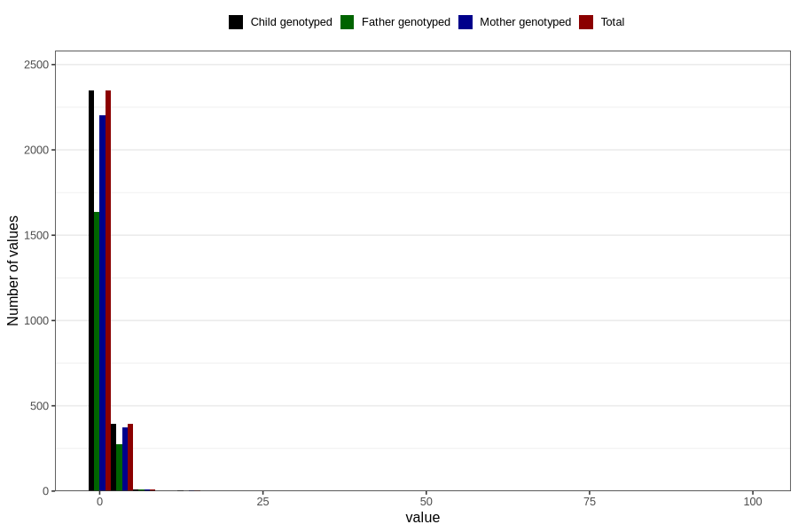

# ear_infection_freq_6m
Variable mapping to `DD272` in `Skjema4_6mnd_v12`.
- Number of values:

| Value | Total | Child genotyped | Mother genotyped | Father genotyped |
| ----- | ----- | --------------- | ---------------- | ---------------- |
| Missing | 78048 | 78048 | 73431 | 51242 |
| Non-missing | 2758 | 2758 | 2593 | 1921 |
| 0 | 93 | 93 | 89 | 72 |
| 1 | 2254 | 2254 | 2113 | 1563 |
| 2 | 300 | 300 | 285 | 204 |
| 3 | 69 | 69 | 66 | 52 |
| 4 | 17 | 17 | 15 | 10 |
| 5 | 9 | 9 | 9 | 8 |
| 6 | 5 | 5 | 5 | 5 |
| 7 | 7 | 7 | 7 | 5 |
| 10 | 1 | 1 | 1 | 1 |
| 12 | 1 | 1 | 1 | 0 |
| 15 | 1 | 1 | 1 | 0 |
| 99 | 1 | 1 | 1 | 1 |

