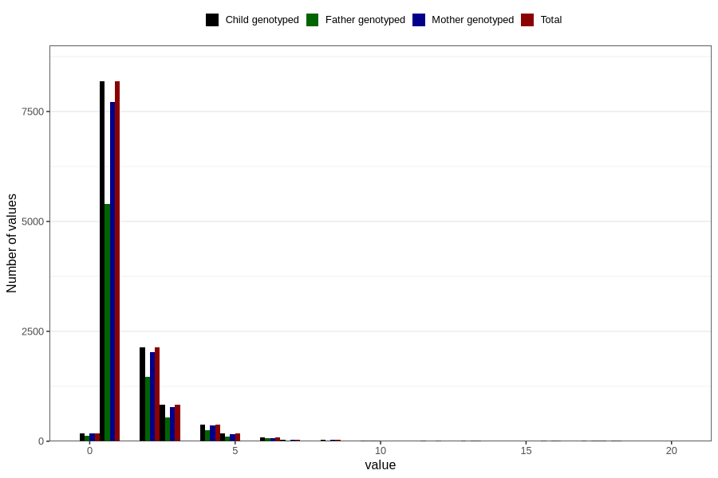

# ear_infection_number_12_18m
Variable mapping to `EE228` in `Skjema5_18mnd_v12`.
- Number of values:

| Value | Total | Child genotyped | Mother genotyped | Father genotyped |
| ----- | ----- | --------------- | ---------------- | ---------------- |
| Missing | 68724 | 68724 | 64615 | 45152 |
| Non-missing | 12082 | 12082 | 11409 | 8011 |
| 25th percentile | 1 | 1 | 1 | 1 |
| 50th percentile | 1 | 1 | 1 | 1 |
| 75th percentile | 2 | 2 | 2 | 2 |
| Mean | 1.58326436020526 | 1.58326436020526 | 1.58602857393286 | 1.5792035950568 |
| Standard deviation | 1.38722923044677 | 1.38722923044677 | 1.39586561925694 | 1.36993285231148 |
| N | 12082 | 12082 | 11409 | 8011 |

