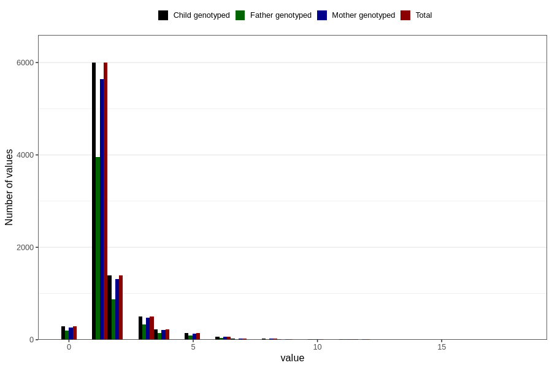

# ear_infection_number_6_11m
Variable mapping to `EE226` in `Skjema5_18mnd_v12`.
- Number of values:

| Value | Total | Child genotyped | Mother genotyped | Father genotyped |
| ----- | ----- | --------------- | ---------------- | ---------------- |
| Missing | 72111 | 72111 | 67827 | 47494 |
| Non-missing | 8695 | 8695 | 8197 | 5669 |
| 0 | 288 | 288 | 269 | 196 |
| 1 | 5995 | 5995 | 5646 | 3959 |
| 2 | 1392 | 1392 | 1312 | 877 |
| 3 | 504 | 504 | 481 | 326 |
| 4 | 228 | 228 | 216 | 142 |
| 5 | 139 | 139 | 133 | 87 |
| 6 | 67 | 67 | 60 | 37 |
| 7 | 29 | 29 | 27 | 17 |
| 8 | 19 | 19 | 19 | 8 |
| 9 | 6 | 6 | 6 | 4 |
| 10 | 15 | 15 | 15 | 7 |
| 11 | 6 | 6 | 6 | 5 |
| 12 | 5 | 5 | 5 | 3 |
| 15 | 1 | 1 | 1 | 1 |
| 18 | 1 | 1 | 1 | 0 |

