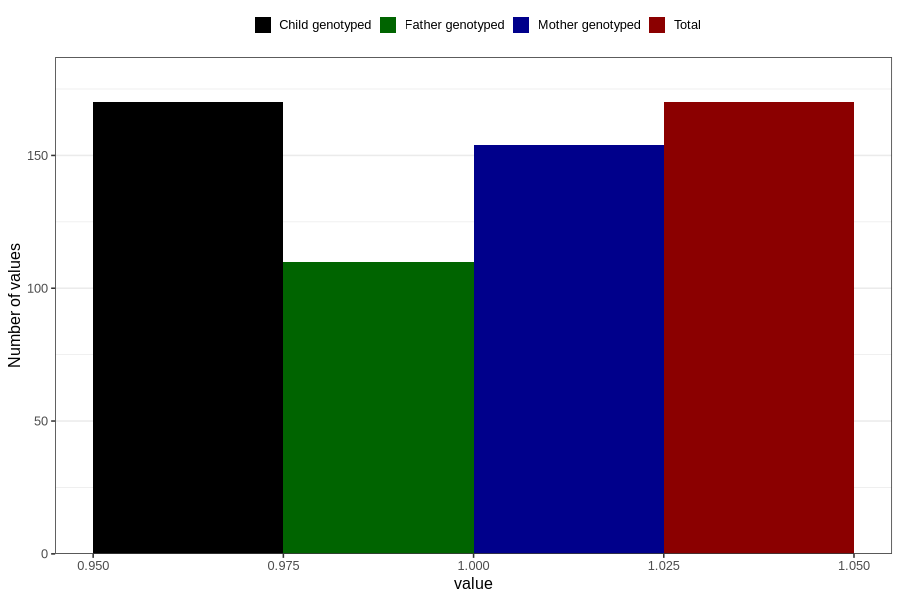

# epilepsy_8y
Variable mapping to `NN29` in `Skjema8aar_v12`.
- Number of values:

| Value | Total | Child genotyped | Mother genotyped | Father genotyped |
| ----- | ----- | --------------- | ---------------- | ---------------- |
| Missing | 80636 | 80636 | 75870 | 53053 |
| Non-missing | 170 | 170 | 154 | 110 |
| 1 | 170 | 170 | 154 | 110 |

