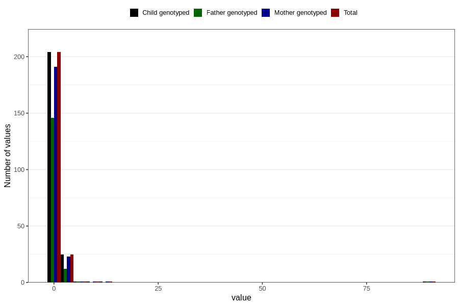

# febrile_convulsions_freq_6m
Variable mapping to `DD296` in `Skjema4_6mnd_v12`.
- Number of values:

| Value | Total | Child genotyped | Mother genotyped | Father genotyped |
| ----- | ----- | --------------- | ---------------- | ---------------- |
| Missing | 80573 | 80573 | 75806 | 53003 |
| Non-missing | 233 | 233 | 218 | 160 |
| 0 | 91 | 91 | 87 | 67 |
| 1 | 113 | 113 | 104 | 79 |
| 2 | 20 | 20 | 19 | 10 |
| 3 | 3 | 3 | 3 | 1 |
| 4 | 2 | 2 | 1 | 1 |
| 5 | 1 | 1 | 1 | 1 |
| 8 | 1 | 1 | 1 | 0 |
| 11 | 1 | 1 | 1 | 0 |
| 90 | 1 | 1 | 1 | 1 |

