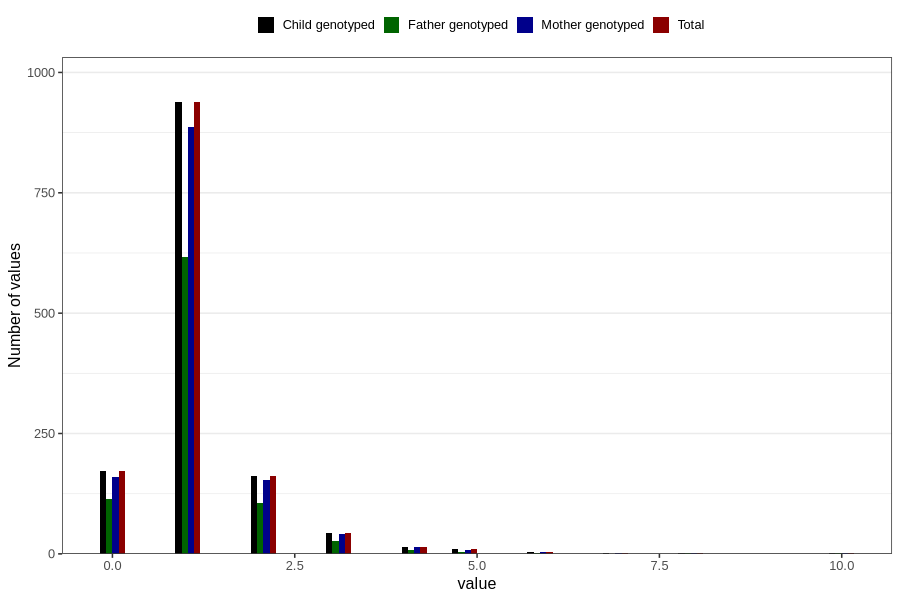

# febrile_convulsions_number_12_18m
Variable mapping to `EE258` in `Skjema5_18mnd_v12`.
- Number of values:

| Value | Total | Child genotyped | Mother genotyped | Father genotyped |
| ----- | ----- | --------------- | ---------------- | ---------------- |
| Missing | 79455 | 79455 | 74748 | 52283 |
| Non-missing | 1351 | 1351 | 1276 | 880 |
| 0 | 173 | 173 | 160 | 113 |
| 1 | 938 | 938 | 887 | 617 |
| 2 | 162 | 162 | 154 | 106 |
| 3 | 43 | 43 | 42 | 27 |
| 4 | 14 | 14 | 14 | 9 |
| 5 | 11 | 11 | 9 | 4 |
| 6 | 4 | 4 | 4 | 1 |
| 7 | 2 | 2 | 2 | 0 |
| 8 | 2 | 2 | 2 | 2 |
| 10 | 2 | 2 | 2 | 1 |

