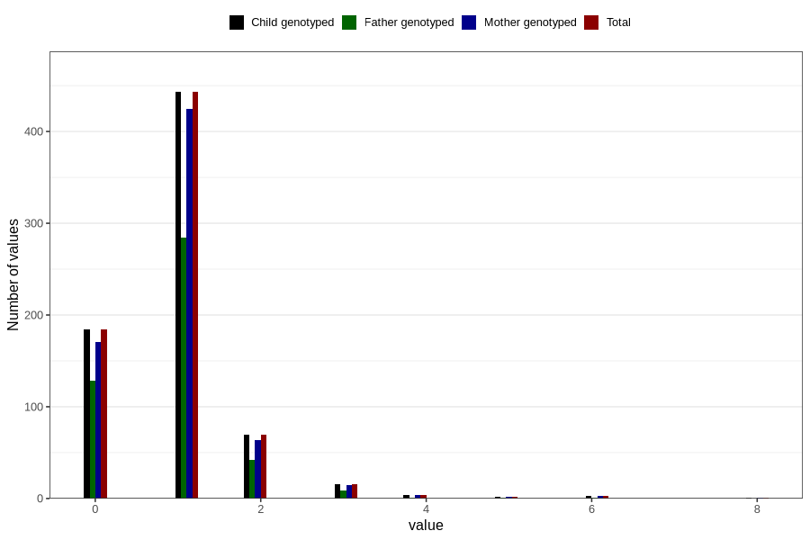

# febrile_convulsions_number_6_11m
Variable mapping to `EE256` in `Skjema5_18mnd_v12`.
- Number of values:

| Value | Total | Child genotyped | Mother genotyped | Father genotyped |
| ----- | ----- | --------------- | ---------------- | ---------------- |
| Missing | 80083 | 80083 | 75339 | 52697 |
| Non-missing | 723 | 723 | 685 | 466 |
| 0 | 184 | 184 | 171 | 128 |
| 1 | 443 | 443 | 425 | 284 |
| 2 | 70 | 70 | 64 | 42 |
| 3 | 16 | 16 | 15 | 9 |
| 4 | 4 | 4 | 4 | 1 |
| 5 | 2 | 2 | 2 | 1 |
| 6 | 3 | 3 | 3 | 1 |
| 8 | 1 | 1 | 1 | 0 |

