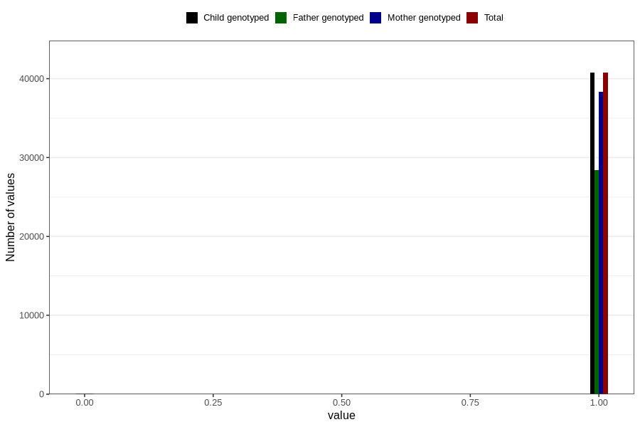

# frequent_stomach_pain_no_3y
Variable mapping to `GG570` in `Skjema6_3aar_v12`.
- Number of values:

| Value | Total | Child genotyped | Mother genotyped | Father genotyped |
| ----- | ----- | --------------- | ---------------- | ---------------- |
| Missing | 39951 | 39951 | 37597 | 24638 |
| Non-missing | 40855 | 40855 | 38427 | 28525 |
| 0 | 109 | 109 | 102 | 73 |
| 1 | 40746 | 40746 | 38325 | 28452 |

